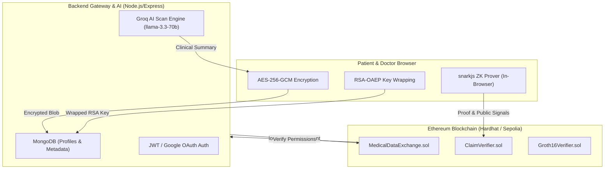

# 🛡️ MedZK: Web3 Privacy-Preserving Medical Data Exchange

[](https://soliditylang.org/)
[](https://reactjs.org/)
[](https://vitejs.dev/)
[](https://hardhat.org/)
[](https://docs.circom.io/)
[](https://groq.com/)
[](https://www.mongodb.com/)

**MedZK** is a patient-controlled, Web3 privacy-preserving medical data exchange powered by **Zero-Knowledge Proofs (ZK-SNARKs)**, **Client-Side AES-256-GCM / RSA-OAEP Hybrid Encryption**, **Groq AI Clinical Scanning**, **Google OAuth & JWT Sessions**, and **MongoDB Off-Chain Storage**.

---

## 🌟 Key Features & Capabilities

- 🔐 **End-to-End Encryption**: Medical records are encrypted in the patient's browser using **AES-256-GCM**. AES keys are wrapped via **RSA-OAEP** public keys for authorized doctors.
- ⚡ **Zero-Knowledge Proofs (ZK-SNARKs)**: Generated in-browser using `snarkjs` and verified on-chain via Circom circuits (e.g. proving "Age ≥ 18" or "Vaccination Status" without revealing birth year or identity).
- 🤖 **Groq AI Clinical Scanner**: Automated AI report analysis using `llama-3.3-70b-versatile` with an intelligent offline clinical fallback engine to highlight key findings, abnormal metrics, and health recommendations.
- 🔑 **Google OAuth & JWT Authentication**: Multi-modal login via MetaMask Web3 wallets or Google OAuth with JWT session persistence.
- 🏥 **Role-Based Access Control (RBAC)**: Distinct workflows tailored for **System Admin**, **Hospital Admins**, **Doctors** (with medical specialties), and **Patients**.
- 📜 **On-Chain Audit Ledger**: Access requests, time-limited approvals (max 30 days), revocations, emergency break-glass, and verification logs are recorded transparently on Ethereum smart contracts.
- 🎨 **Charcoal Obsidian & Silver Metallic UI**: Premium dark mode UI with interactive top metric grids, instant demo auto-fillers, and account switcher options.

---

## 🏗️ System Architecture



---

## 📁 Repository Structure

```
Medx_Privacy-Preserving-Blockchain/
├── circuits/           # Circom EdDSA credential circuit & build scripts
├── blockchain/         # Solidity smart contracts, Hardhat tests & scripts
│   ├── contracts/      # MedicalDataExchange.sol, ClaimVerifier.sol
│   └── scripts/        # Deployment and seeding scripts
├── backend/            # Express REST API, Groq AI scanner, MongoDB schemas
│   └── src/            # Auth, record routes, contracts, MongoDB models
├── frontend/           # React + Vite client (MetaMask, ZK Prover, UI Views)
│   └── src/            # Views (Admin, Hospital, Doctor, Patient, Onboarding)
└── docker-compose.yml  # MongoDB container orchestration
```

---

## 🔑 Test Accounts & Demo Private Keys

Connect MetaMask to **Localhost RPC** (`http://127.0.0.1:8545`, Chain ID `31337`) and import these pre-funded test accounts:

| Role | Wallet Address | Private Key | Description |
| :--- | :--- | :--- | :--- |
| **System Admin** | `0xf39Fd6e51aad88F6F4ce6aB8827279cffFb92266` | `0xac0974bec39a17e36ba4a6b4d238ff944bacb478cbed5efcae784d7bf4f2ff80` | Contract Deployer. Registers Hospitals on-chain. |
| **Hospital Admin**| `0x15d34AAf54267DB7D7c367839AAf71A00a2C6A65` | `0x47e179ec197488593b187f80a00eb0da91f1b9d0b13f8733639f19c30a34926a` | Pre-configured hospital (**City General Hospital**). |
| **Doctor** | `0x70997970C51812dc3A010C7d01b50e0d17dc79C8` | `0x59c6995e998f97a5a0044966f0945389dc9e86dae88c7a8412f4603b6b78690d` | Registers under a registered hospital with specialty. |
| **Patient** | `0x3C44CdD076671963E1329A3c0a684b39b36d93BC` | `0x5de4111afa1a4b94908f83103eb1f1706367c2e68ca870fc3fb9a804cdab365a` | Uploads encrypted records, runs AI scans & generates ZK proofs. |

---

## 🚀 Quick Start Guide

### 1. Prerequisites
- **Node.js**: `v18.x` or `v20.x`
- **MongoDB**: Active local MongoDB daemon or Docker container (`mongodb://127.0.0.1:27017/medzk`)
- **MetaMask**: Browser Extension

### 2. Start Services

Open 4 terminal windows from the repository root:

#### Terminal 1: MongoDB Database
```bash
docker compose up -d
```

#### Terminal 2: Blockchain RPC Node
```bash
cd blockchain
npm install
npx hardhat node
```

#### Terminal 3: Deploy Contracts & Launch Backend API
```bash
cd blockchain
npm run deploy:local

cd ../backend
npm install
npm run dev
# Backend API listening on http://localhost:4000/api
```

#### Terminal 4: Launch Frontend Application
```bash
cd frontend
npm install
npm run dev
# Access UI at http://localhost:5173/
```

---

## 🧪 Smart Contract Verification & Testing

To run the automated Hardhat test suite covering contract registration, time-limited access grants, emergency break-glass, and ZK-SNARK Groth16 verification:

```bash
cd blockchain
npm test
```

---

## 🔒 Security Architecture & Privacy Principles

1. **Client-Side Encryption First**: Plaintext medical data never leaves the patient's device unencrypted.
2. **On-Chain Pseudonymity**: Patient identity and raw health records are decoupled on the blockchain using SHA-256 ciphertext hashes and pseudonymous wallet addresses.
3. **ZK-SNARK Zero-Knowledge Proofs**: Patients can satisfy hospital or insurer credential requests without exposing underlying birth dates, full names, or full medical histories.
4. **Time-Bound Revocable Grants**: Access grants automatically expire on-chain and can be revoked at any point by the patient with immediate effect.

---

## 📄 License

Distributed under the **MIT License**. See `LICENSE` for details.
